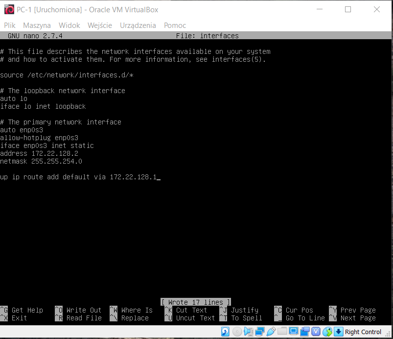
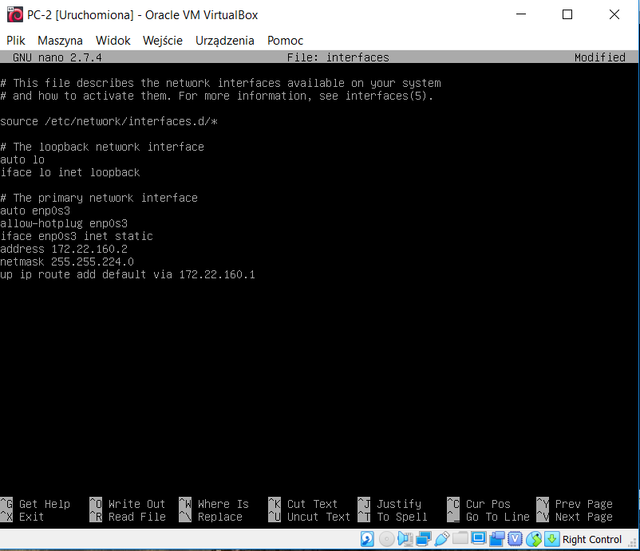
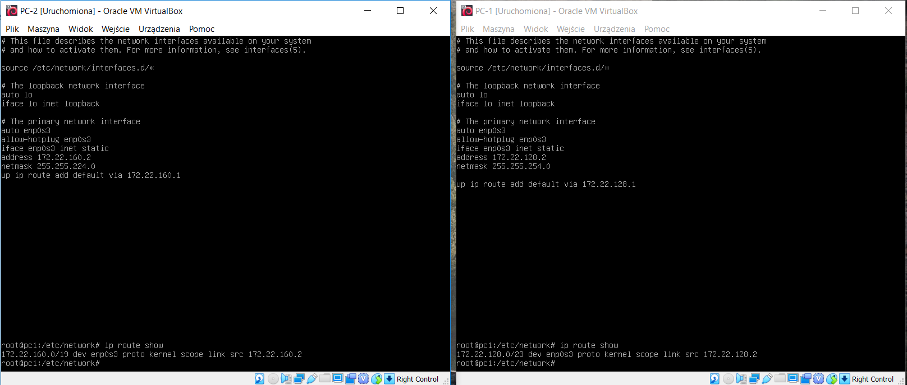
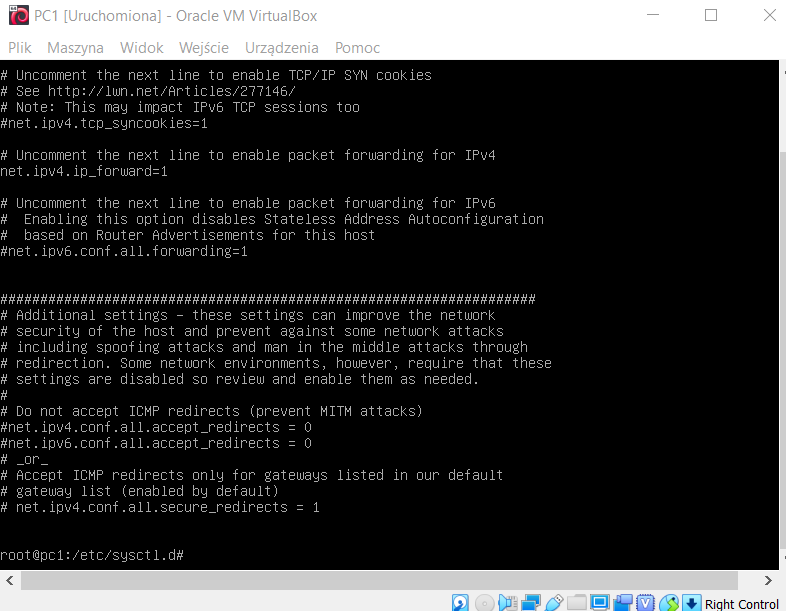

1.Utworzenie w środowisku VirtualBox 3 maszyn:

2.Utworzenie dwóch sieci NAT:

3. Wybór masek podsieci i adresów IP

bazowy adres sieci - 172.22.128.0/17 - 32766 hostów

Jeżeli chcemy zaadresować 500 urządzeń w sieci to musimy wybrać maskę /23 ( 255.255.254.0)

Jeżeli chcemy zaadresować 5000 urządzeń to musimy wybrać maskę /19 (255.255.224.0)

172.22.128.0/19 - 8190 hostów

172.22.128.0/23 - 510 hostów

**PC-0** podłączony na karcie nr 1 do NAT, na karcie nr.2 podłączony do sieci NAT LAN-1, na karcie nr.3 podłączony do LAN-2

**PC-1** podłączony na karcie nr 1 do sieci LAN-1

**PC-2** podłączony na karcie nr 1 do sieci LAN-2

Ustalenie konfiguracji sieci dla:

**PC-0:**

**PC-1:**

**PC-2:**

4. Ustawienie routingu na maszynach PC-1 i PC-2

Sprawdzenie poprawności: 
ip route show

EFEKT:

5. Ustawienie forwardowania (PC-0)

  edycja pliku /etc/sysctl.d/99-sysctl.conf
    należy odkomentować linijkę:
    #Uncomment the next line to enable packet forwarding for IPv4
      
      
6. Dodanie masquerade (PC-0)

Edycja pliku /etc/iptables.up.rules
  Należy dopisać w tym pliku:
  iptables -t nat -A POSTROUTING -s 172.22.128.0/23 -o enp0s3 -j MASQUERADE
  iptables -t nat -A POSTROUTING -s 172.22.160.0/19 -o enp0s3 -j MASQUERADE
  
  A żeby te reguły były wczytywane przy starcie maszyny należy edytować plik 
  
  /etc/network/interfaces 
  
  dopisując na końcu: 
    
    post-up iptables-restore < /etc/iptables.up.rules

7. Dodanie w pliku /etc/resolv.conf dla maszyn PC-1 i PC-2 adresów DNS:

  nameserver 1.1.1.1

