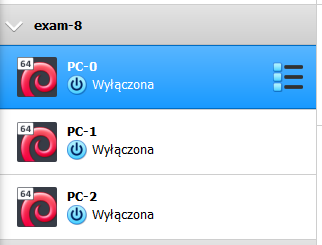
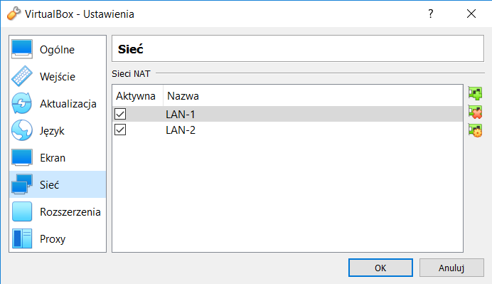
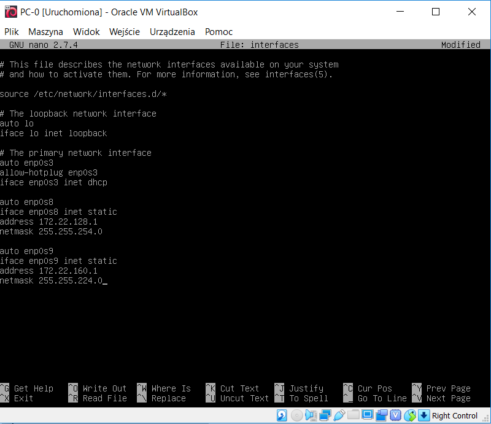
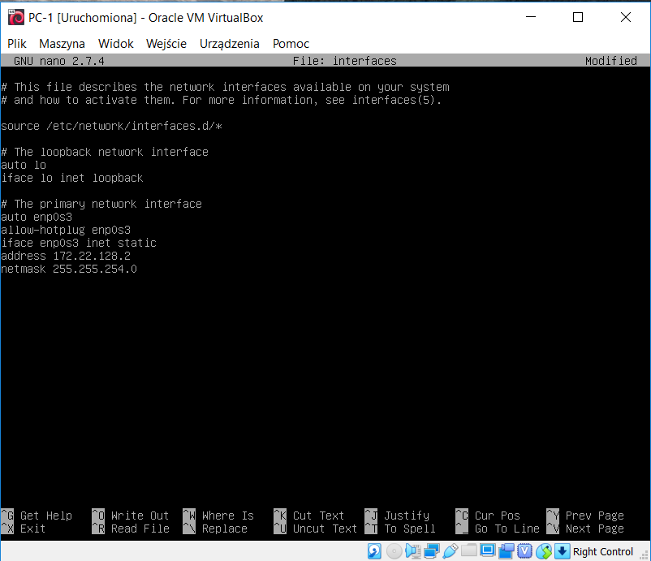
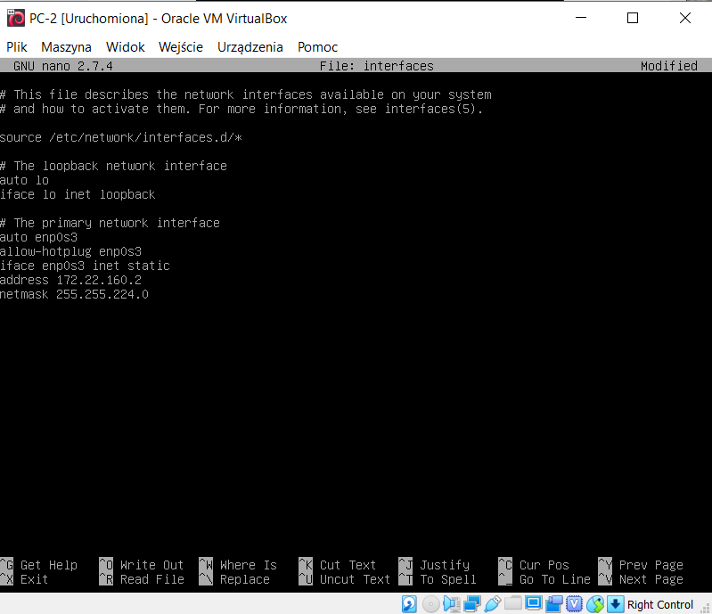

1.Utworzenie w środowisku VirtualBox 3 maszyn:

2.Utworzenie dwóch sieci NAT:

3. Wybór masek podsieci i adresów IP

bazowy adres sieci - 172.22.128.0/17 - 32766 hostów

Jeżeli chcemy zaadresować 500 urządzeń w sieci to musimy wybrać maskę /23 ( 255.255.254.0)

Jeżeli chcemy zaadresować 5000 urządzeń to musimy wybrać maskę /19 (255.255.224.0)

172.22.128.0/19 - 8190 hostów

172.22.128.0/23 - 510 hostów

**PC-0** podłączony na karcie nr 1 do NAT, na karcie nr.2 podłączony do sieci NAT LAN-1, na karcie nr.3 podłączony do LAN-2

**PC-1** podłączony na karcie nr 1 do sieci LAN-1

**PC-2** podłączony na karcie nr 1 do sieci LAN-2

Ustalenie konfiguracji sieci dla:

**PC-0:**

**PC-1:**

**PC-2:**

